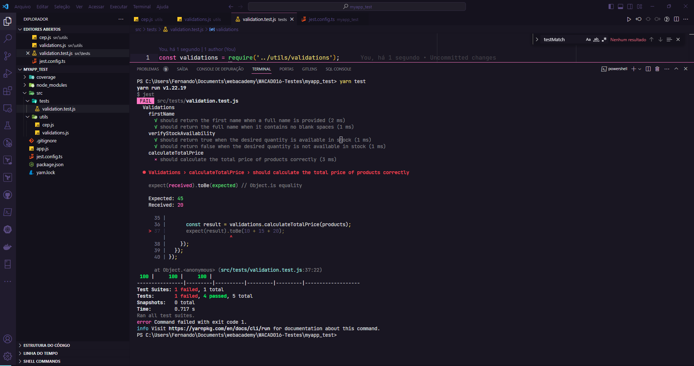
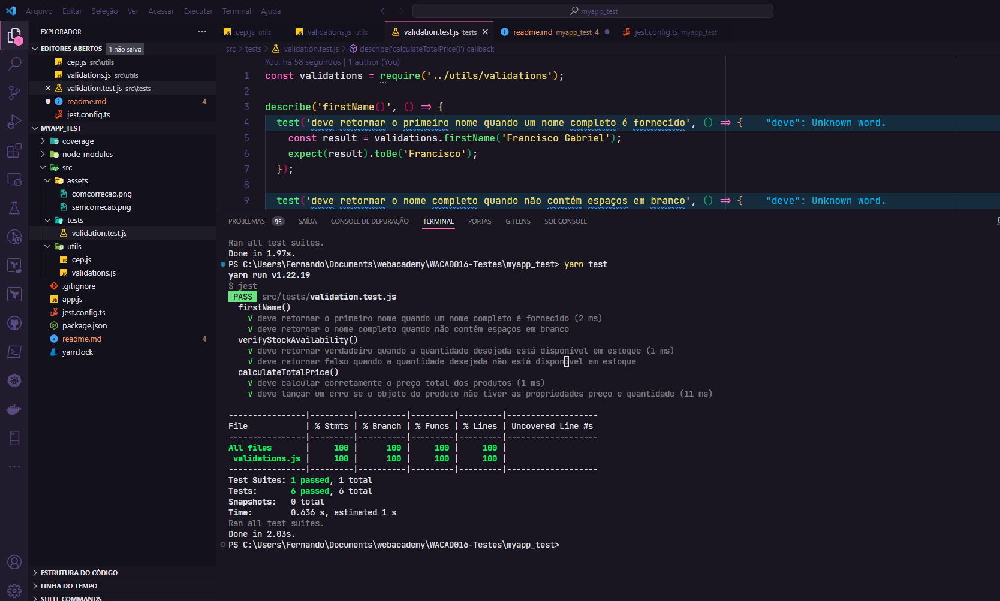

# Testes unitário com Jest (Backend)


- [Testes unitário com Jest (Backend)](#testes-unitário-com-jest-backend)
  - [Instalação e execução](#instalação-e-execução)
  - [Antes da correção](#antes-da-correção)
  - [Depois da correção](#depois-da-correção)


## Instalação e execução

1. Clone o repositório:

   ```bash
   git clone https://github.com/FranciscoGabriel1/jest-myapp-test.git

2. Usando npm:

   ```bash
   npm install && npm test
3. Usando Yarn

   ```bash
    yarn install && yarn test
## Antes da correção




## Depois da correção
 
